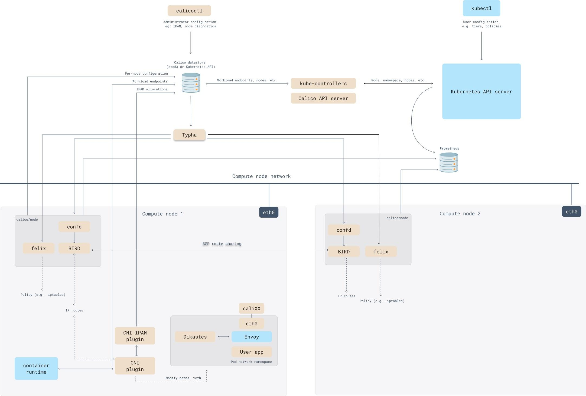

Calico is an open-source networking and security solution for containerized applications. It is a popular choice for Kubernetes clusters, and it is used by a wide range of organizations, including Google, Netflix, and Spotify.

Calico is made up of a number of different components, each of which plays a specific role in the networking stack.

## Calico Key components

1. `Calico API server`: This is the central component of Calico. It provides a REST API that is used to manage the Calico network.
2. `Felix`: This is the agent that runs on each node in the cluster. It is responsible for configuring the network on each node and enforcing network policies.
3. `BIRD`: This is a routing daemon that is used to exchange routing information between nodes.
4. `confd`: This is a configuration daemon that is used to manage the configuration of Felix and BIRD.
5. `CNI plugin`: This is a plugin that is used to configure the network for containers.
6. `Datastore plugin`: This is a plugin that is used to store the Calico configuration data.
7. `IPAM plugin`: This is a plugin that is used to allocate IP addresses to containers.
8. `Typha`: This is a daemon that is used to collect and store network telemetry data.

These are just the key Calico components. There are a number of other components that are used for specific tasks, such as the Calico Kubernetes controller and the Calico CLI.

The Calico components work together to provide a high-performance, scalable, and secure networking solution for containerized applications. By understanding the different components and how they work, you can better understand how Calico works and how to use it to secure your containerized applications.



## Encapsulation
Calico supports the following types of encapsulation:

1. VXLAN: VXLAN is a tunneling protocol that encapsulates traffic in a layer 2 header. It is supported by most cloud providers and can be used to connect containers across different subnets and VLANs.

2. IP-in-IP: IP-in-IP is a tunneling protocol that encapsulates traffic in another IP packet. It is a simpler protocol than VXLAN, but it is not supported by all cloud providers.

3. Cross-subnet: Cross-subnet encapsulation is a mode of VXLAN or IP-in-IP encapsulation where traffic is only encapsulated when it crosses subnet boundaries. This can be used to improve performance by reducing the amount of encapsulation overhead.

4. No encapsulation: No encapsulation is a mode where traffic is not encapsulated at all. This can be used to improve performance in environments where encapsulation is not required.

The best type of encapsulation to use depends on your specific requirements. If you need to connect containers across different subnets or VLANs, then VXLAN is a good choice. If you need a simpler protocol, then IP-in-IP is a good option. And if you need to improve performance, then you can use cross-subnet encapsulation or no encapsulation.

| Type | Description |
|---|---|
| VXLAN | Encapsulates traffic in a layer 2 header. Supported by most cloud providers. Can be used to connect containers across different subnets and VLANs. |
| IP-in-IP | Encapsulates traffic in another IP packet. Simpler protocol than VXLAN. Not supported by all cloud providers. |
| Cross-subnet | Traffic is only encapsulated when it crosses subnet boundaries. Can be used to improve performance by reducing the amount of encapsulation overhead. |
| No encapsulation | Traffic is not encapsulated at all. Can be used to improve performance in environments where encapsulation is not required. |

## Encapsulation Change
you can change the Calico encapsulation from kubectl edit ippols.

The ippols resource is used to configure the IP pools in Calico. The encapsulation field in the ippols resource controls the encapsulation type.
To change the encapsulation from kubectl edit ippols, use the following command:
```
kubectl edit ippols <ip-pool-name>
```
In the editor, you would change the encapsulation field to the desired encapsulation type. For example, to change the encapsulation to VXLAN, you would set this field to vxlan.
Once you have saved the changes, the new encapsulation setting will be in effect.

IPIP Mode Enable example

```
apiVersion: projectcalico.org/v3
kind: IPPool
metadata:
  name: my-ippool
spec:
  cidr: 10.1.0.0/16
  ipipMode: Always
  natOutgoing: true
  disabled: false
  nodeSelector: all()
```
VXLAN Enable example

```
apiVersion: projectcalico.org/v3
kind: IPPool
metadata:
  name: my-ippool
spec:
  cidr: 10.1.0.0/16
  ipipMode: VXLAN
  natOutgoing: true
  disabled: false
  nodeSelector: all()
```